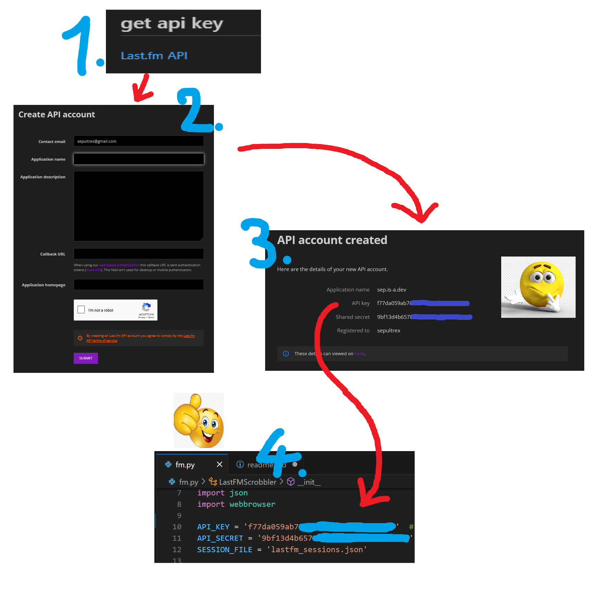
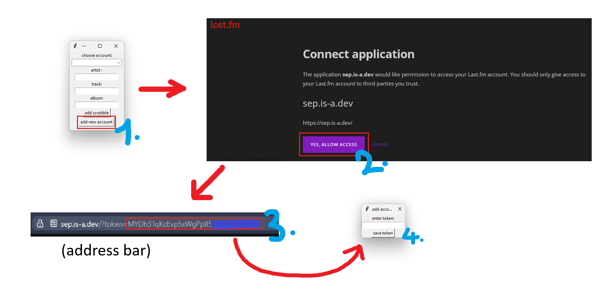
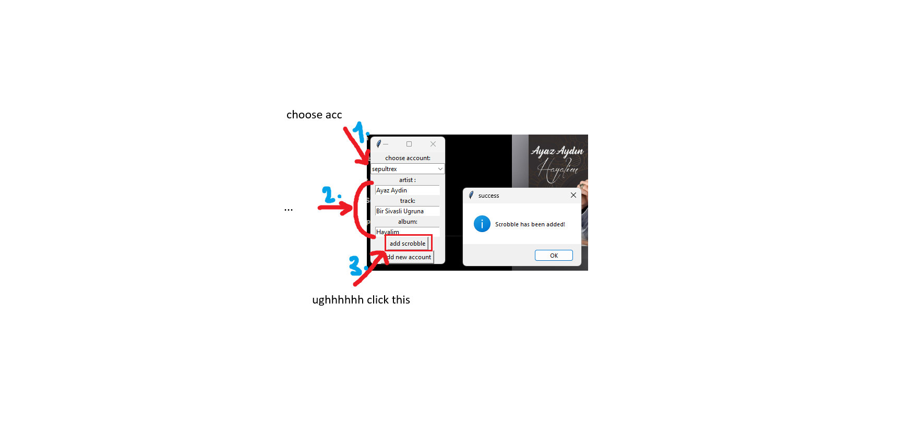

Last.fm Scrobbler

adding music to your Last.fm account... thats literally all it does

## install libs 

   ```bash
   pip install requests
   ```

## get api key

[Last.fm API](https://www.last.fm/api/account/create)

### how to get api key

### how to add new accounts



## how to use 🤔
did you really need that!?????
<br><br><br><br>nvm


